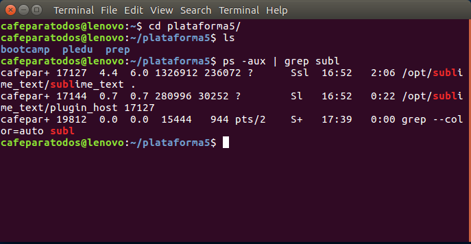
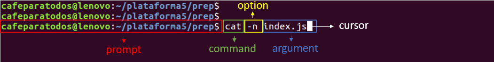

# Command Line Interface


## Intro

### Interfaces

#### CLI

Un _**CLI**_ o _**interfaz de línea de comandos**_ es una interfaz basada en texto que le permite al usuario interactuar con el sistema operativo.

El programa que maneja esa interacción se le llama **emulador de terminal** (**command language interpreter**) o **shell**.

Las CLI pueden usarse de modo interactiva, escribiendo instrucciones en una entrada de texto, o pueden utilizarse de una forma automatizada leyendo órdenes desde un archivo de scripts.



#### GUI

Esta no es la única interfaz que conocemos, de hecho es la que menos conocemos, la mas usada se llama GUI (_Graphic user interface_) y es el modelo que usa casi todo el software que usamos.

Se compone de una ventana con iconos, botones y menús que te permiten navegar de manera _intuitiva_ y sin _conocimientos previos_.


#### CLI vs GUI

A pesar de las ventajas que pueda traer un GUI es muy importante el manejo de interfaces basadas en texto (CLI), porque es la mejor manera de trabajar con la mayoría de los programas y de la manera mas eficiente.

Algunas de sus ventajas son:

  * _**Velocidad**_: Una vez familiarizado con los comandos y el flujo de trabajo, la velocidad de acción es notoriamente superior a la de un GUI.
  * _**Menos recursos**_: Un CLI utiliza menos recursos para operar que un interfaz gráfica y permite un uso optimizado de la PC.
  * _**Pocos cambios**_: La interfaz gráfica de los programas suele cambiar mucho en poco tiempo y tenemos que estar acostumbrándonos a los nuevos UI con cada versión, en cambio un CLI no suele cambiar y en caso de que si, suele ser solo para agregar una nueva funcionalidad.
  * _**Poderosos**_: Se pueden correr scripts que realicen muchas acciones a la vez.


### Anatomía de un comando

Un comando esta formado por varias partes:



* __*Prompt*__ : Da información del entorno bajo el que estas trabajando e indica que el shell(terminal) esta listo para recibir un nuevo comando.

  > en el bash de los sistemas UNIX se usa el signo $

  > en el CMD de Windows se usa el signo >

* __*Command Name*__ : Es lógicamente el nombre propio del comando que vamos a usar, es único y es como el CLI va a reconocer que buscamos hacer. Es el que encabeza el comando.

* __*Flags u Options*__ : Son configuraciones extra que le vamos a dar a nuestro comando, empiezan siempre con uno o dos guiones medios (-) y luego una letra o palabra que represente la opción especifica que queremos activar. Puede ir tanto antes como después del argumento.

* __*Argument*__ Es el parámetro al que queremos hacer referencia con nuestro comando. Puede ser mas de uno separados por espacios en blanco.

Por ejemplo 

``` bash
$ cd plataforma5  // command + argument

$ ls -a  // command + option

$ rm -r exampleFolder  // command + option + argument
```

### Poniendo en practica

#### Accediendo a la terminal

Ahora vamos a ver un poco como acceder al **shell**,

Si estamos en Linux podemos abrir el prompt de búsqueda y escribimos **terminal**, dependiendo en tu distro puede variar, entre la tecla súper o súper + space

> Ubuntu y Mint (entre otros) te permite entrar con el shortcut Ctrl + Alt + T

Estando en MacOS Ctrl+Space para abrir el prompt de búsqueda y escribimos **terminal**

Ahora podemos pasar al siguiente topic y empezar a trabajar

## Comandos

### Comandos simples

Hagamos una prueba con algunos comandos clásicos así nos familiarizamos con su uso.

#### Echo

Empezamos con `echo`, este comando imprime los argumentos que le pasemos en la consola.

``` bash
$ echo hola plataforma5
# hola plataforma5
```

> En este caso "hola" y "plataforma5" son argumentos distintos, separados por el espacio, si quisiéramos que fuera todo un solo argumento tendríamos que cambiar el comando a `echo "hola plataforma5"`, ambas maneras funcionan.

#### List

Un comando muy util y que van a usar constantemente es `ls` (list), sirve para listar todas carpetas y archivos de la carpeta en la que estamos parados.

``` bash
$ ls
# Desktop    Downloads  plataforma5  Videos 
# Documents  Pictures   Public
```

> Agregandole `-a` (all) como option podemos listar los archivos ocultos tambien, o `-l` (list) para obtener mas información de los archivos en forma de lista. Combinando ambos tenemos un listado completo de los archivos incluyendo los ocultos `ls -la`, Pruébenlo!
 
Si queremos listar una carpeta mas adentro solo hay que pasarlo como argumento

``` bash
$ ls plataforma5
# bootcamp    intro     pledu      prep 
```

#### Manual

Cada comando tiene sus options o flags, pero como podemos saber cuales son?
para eso podemos usar el commando `man` (manual) que nos dará información detallada de cada comando.

``` bash
$ man ls
```

> **Enter** para scrollear en el manual y **q** para salir

#### Change Directory

Todo genial por ahora pero solo estamos trabajando desde la carpeta `home`, para movernos en nuestro disco podemos usar el comando `cd` (change directory) pasándole como argumento la carpeta a la que queramos acceder.

``` bash
$ cd plataforma5
```

Si queremos entrar en una carpeta mas profunda podemos pasar como argumento la ruta entera separadas las carpetas por `/`

``` bash
$ cd plataforma5/prep/cli
```

> la tecla `Tab` nos permite auto completar la carpeta que estamos escribiendo, prueben escribir la mitad de una carpeta y apretar `Tab` (no va a funcionar si hay dos carpetas que se llamen igual hasta donde nosotros escribimos)

Si queremos volver una carpeta para atrás solo tenemos que pasar `..` como argumento.

``` bash
$ cd ..
```

> Usando `cd` sin nungun argumento regresamos al home directamente

#### Print Working Directory

Moviéndonos tanto de carpeta puede que quieran saber la dirección de donde están trabajando, para eso sirve `pwd`

``` bash
$ pwd
# /home/cafeparatodos/plataforma5/prep/cli
```


### Manejando archivos

Ahora que entendemos un poco el flujo del shell vamos a crear y modificar nuestros archivos.

#### make subdirectory

Para arrancar este modulo vamos a trabajar en una nueva carpeta _test_. La podemos crear con el comando `mkdir`(make subdirectory).

``` bash
$ ls 
# carpeta_vieja
$ mkdir test
$ ls
# carpeta_vieja   test
```

Ya tenemos nuestra carpeta _test_ creada, pero que si quiero crear una nueva carpeta mas adentro en mi árbol de carpetas? se puede, al igual que con `cd` podemos encadenar carpetas para trabajar en niveles mas profundos.

``` bash
$ mkdir test/carpetaInterior
$ ls test
# carpetaInterior
```

> `mkdir` recibe tantos argumentos como carpetas quieras crear, `$ mkdir folder1 folder2 folder3`.

> La opcion `-p` crea todas las carpetas que hagan falta para cumplir la orden y no resulta en error si estas ya existen.
> `$ mkdir -p test/carpetaInterior` no dará error si _test_ no esta creado, ni tampoco si _carpetaInterior_ ya se creo antes.

#### touch 

La función de este comando es cambiar la hora y fecha de acceso o modificación de un archivo, pero tiene la particularidad de que si no existe el archivo pedido por argumento lo crea vació. Entonces esa característica es la que le da su verdadero uso.

``` bash
$ touch test/miArchivo.js
$ ls test
# carpetaInterior   miArchivo.js
```

También podemos crear muchos archivos juntos si los pasamos como argumento.

``` bash
$ cd test
$ touch app.js model.js index.html
$ ls
# app.js  carpetaInterior  index.html  miArchivo.js  model.js
```

#### remove

El comando `rm` sirve para borrar archivos o carpetas.

``` bash
$ rm miArchivo.js
$ ls
# app.js  carpetaInterior  index.html  model.js
```

Si queremos borrar una carpeta de la misma manera que un archivo nos da un error. Porque para borrar un directorio(carpeta) tenemos que necesariamente borrar todos sus archivos interiores, vamos a usar la opción `-r` (recursive)
para que borre todos los componentes interiores.

``` bash
$ touch carpetaInterior/archivoParaBorrar
$ ls carpetaInterior
# archivoParaBorrar
$ rm -r carpetaInterior
$ ls
# app.js  index.html  model.js
```

> Adivinan que pasa si llamo al comando con mas de 1 argumento?
> `$ rm app.js index.html` borraría tanto el primer como el segundo archivo pasado por parámetro.

#### move

El comando `move` nos permite mover y **renombrar** archivos o carpetas, recibe el archivo que se desea mover como primer argumento y su nueva ubicación como segundo.

``` bash
$ mkdir carpetaInterior
$ ls carpetaInterior
#
$ mv model.js carpetaInterior/model.js
$ ls carpetaInterior
# model.js
```

> Con `mv` también podemos cambiarle el nombre a un archivo/directorio
 
``` bash
$ mv carpetaInterior/model.js carpetaInterior/modificado.js
$ ls carpetaInterior
# modificado.js
```

> Se puede hacer ambas cosas a la vez, cambiar el nombre y mover el archivo, hagan una prueba!
 
> Algo a tener en cuenta es que si ya existe un archivo con el mismo nombre en su carpeta de destino, este archivo va a ser **pisado** por el que estamos moviendo. Podemos usar el flag `-i` para que nos pregunte antes de sobre escribir un archivo.

#### copy

De la misma manera que podemos mover archivos también podemos copiarlos.
`cp` usa el mismo sistema que `mv` y va a sobre escribir los archivos de destino que se llamen igual.

``` bash
$ cp -i carpetaInterior/modificado.js afuera.js
$ ls
# afuera.js
```

> Si lo que queremos copiar es una carpeta no olviden el flag `-r`(recursive) para también copiar todos los elementos de adentro.

#### cat

Les puede pasar que no estén seguros de que el archivo/carpeta que planean mover o borrar sea el que ustedes quieren, para tener una vista rápida de que contiene el archivo podemos usar `cat`.

Primero abramos nuestro editor de texto y escribamos algo en un archivo.

``` bash
$ cat afuera.js
# Lo que sea que se haya escrito en el archivo
```

#### history

Con todos estos comandos puede que se mareen y no se acuerden que escribieron antes o en que orden, para eso pueden usar el comando `history` que les muestra los últimos comandos que hicieron en orden cronológico.

``` bash
$ history
```

> Si no quieren ver todo el historial pueden pasar un numero como argumento para ver solo esa cantidad de comandos `$ history 5`.

## Comandos Compuestos

### Super User

Todo este tiempo cuando estuvimos enviando comandos lo hicimos bajo nuestro nombre de usuario (a la izquierda del '@'), esto pasa porque en los sistemas UNIX siempre estamos logeados bajo una sesión de usuario y no con el administrador del SO.
Nos va a pasar que cuando queramos realizar una acción que influya a otros usuarios (por ejemplo: instalar programas de manera global o modificar archivos de la carpeta root) nos va a pedir autorización para ejecutar la acción. Para solucionar esto tenemos que ejecutar esos comandos como root user (administrador) usando el programa `sudo`.

`sudo` (**s**uper **u**ser **do**​) es un programa de los sistemas operativos tipo Unix, como Linux o MacOS, que nos permite ejecutar programas con los privilegios de seguridad de otro usuario (normalmente el usuario root) de manera segura, convirtiéndonos temporalmente en _súper usuario_. Se instala por defecto en /usr/bin.

``` bash
$ sudo apt-get install git
```

### Uniendo comandos

#### concatenación
  
Si quisiéramos ejecutar una serie de comandos y escribirlos todos juntos podemos, usando el operador `&&`

``` bash
$ mkdir carpeta && cd carpeta
```

Este ejemplo nos va a crear una carpeta y luego entrar en ella.

#### enlaces

el operador `>` nos permite guardar el output de un comando como input de otro, entre otras cosas esto sirve para poder cargar información en un archivo

``` bash
$ touch file
$ echo "hello world" > file
$ cat file
# hello world
```

#### pipes

También podemos hacer que un comando repercuta sobre otro con el operados `|` (pipe), al terminar un comando el segundo va a actuar en base al resultado (output) del primero.

``` bash
$ ps -aux | grep chrome
```

> `ps` lista los procesos activos actuales 

> `grep` filtra resultados en base al argumento pasado y un archivo como argumento, o si no recibe archivo el input que reciba anteriormente.

``` bash
$ grep wor file
# hello world
```
