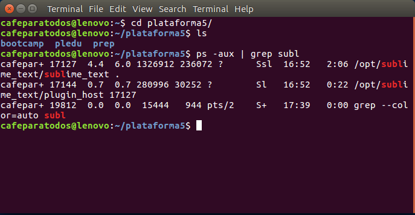
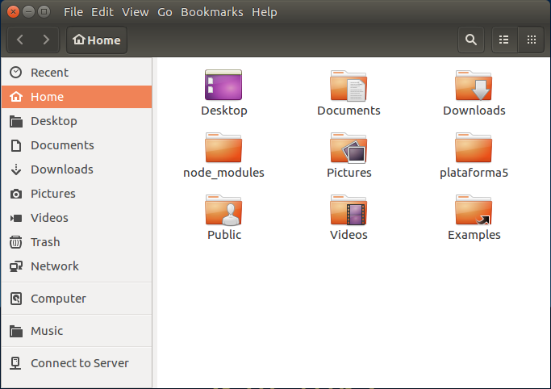
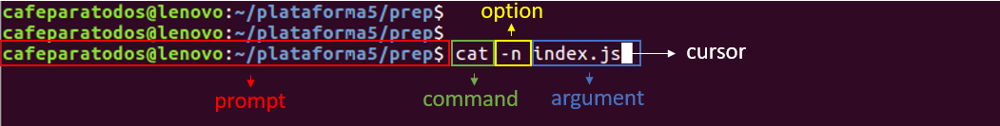

# Command Line Interface


## Intro

### Interfaces

#### CLI

Un _**CLI**_ o _**interfaz de línea de comandos**_ es una interfaz basada en texto que le permite al usuario interactuar con el sistema operativo.

El programa que maneja esa interaccion se le llama **emulador de terminal** (**command language interpreter**) o **shell**.

Las CLI pueden usarse interactivamente, escribiendo instrucciones en una entrada de texto, o pueden utilizarse de una forma automatizada leyendo órdenes desde un archivo de scripts.



#### GUI

Esta no es la unica interfaz que conocemos, de hecho es la que menos conocemos, la mas usada se llama GUI (_Graphic user interface_) y es el modelo que usa casi todo el software que usamos.

Se compone de una ventana con iconos, botones y menus que te permiten navegar de manera _intuitiva_ y sin _conocimientos previos_.



#### CLI vs GUI

Apesar de las ventajas que pueda trater un GUI es muy importante el manejo de interfaces basadas en texto (CLI), porque es la mejor manera de trabajar con la mayoria de los programas y de la manera mas eficiente.

Algunas de sus ventajas son:

  * _**Velocidad**_: Una vez familiarizado con los comandos y el flujo de trabajo, la velocidad de accion es notoriamente superior a la de un GUI.
  * _**Menos recursos**_: Un CLI utiliza menos recursos para operar que un interfaz grafica y permite un uso optimizado de la pc.
  * _**Pocos cambios**_: La interfaz grafica de los programas suele cambiar mucho en poco tiempo y tenemos que estar acostumbrandonos a los nuevos UI con cada version, en cambio un CLI no suele cambiar y en caso de que si, suele ser solo para agragar una nueva funcionalidad.
  * _**Poderosos**_: Se pueden correr scripts que realicen muchas acciones a la vez.


### Anatomia de un comando

Un comando esta formado por varias partes:



| Nombre         | Ejemplo                |  
| -------------- |-----------------------:|
| prompt         | cafeparatodos@lenovo~$ |
| command name   | rm                     |
| options / flag | -r                     |
| argument       | carpeta                |

* __*Prompt*__ : Da informacion del entorno bajo el que estas trabajando e indica que el shell(terminal) esta listo para recibir un nuevo comando.

  > en el bash de los sistemas UNIX se usa el signo $

  > en el CMD de Windows se usa el signo >

* __*Command Name*__ : Es logicamente el nombre propio del comando que vamos a usar, es unico y es como el CLI va a reconocer que buscamos hacer. Es el que encabeza el comando.

* __*Flags u Options*__ : Son configuraciones extra que le vamos a dar a nuestro comando, empiezan siempre con uno o dos guiones medios (-) y luego una letra o palabra que represente la opcion especifica que queremos activar. Puede ir tanto antes como despues del argumento.

* __*Argument*__ Es el parametro al que queremos hacer referencia con nuestro comando. Puede ser mas de uno separados por espacios en blanco.

Por ejemplo 

``` bash
$ cd plataforma5  // command + argument

$ ls -a  // command + option

$ rm -r exampleFolder  // command + option + argument
```

### Poniendo en practica

#### Accediendo a la terminal

Ahora vamos a ver un poco como acceder al **shell**,

Si estamos en Linux podemos abrir el prompt de busqueda y escribimos **terminal**, dependiendo en tu distro puede variar, entre la tecla super o super + space

> Ubuntu y Mint (entre otros) te permite entrar con el shortcut Ctrl + Alt + T

Estando en MacOS Ctrl+Space para abrir el prompt de busqueda y escribimos **terminal**

#### Comandos simples

Hagamos una prueba con algunos comandos clasicos asi nos familiarizamos con su uso.

##### Echo

Empezamos con `echo`, este comando imprime los argumentos que le pasemos en la consola.

``` bash
$ echo hola plataforma5
# hola plataforma5
```

> En este caso "hola" y "plataforma5" son argumentos distintos, separados por el espacio, si quisieramos que fuera todo un solo argumento tendriamos que cambiar el comando a `echo "hola plataforma5"`, ambas maneras funcionan.

##### List

Un comando muy util y que van a usar constantemente es `ls` (list), sirve para listar todas carpetas y archivos de la carpeta en la que estamos parados.

``` bash
$ ls
# Desktop    Downloads  plataforma5  Videos 
# Documents  Pictures   Public
```

> Agregandole `-a` (all) como option pordemos listar los archivos ocultos tambien, o `-l` (list) para obtener mas informacion de los archivos en forma de lista. Combinando ambos tenemos un listado completo de los archivos incluyendo los ocultos `ls -la`, Pruebenlo!
 
Si queremos listar una carpeta mas adentro solo hay que pasarlo como argumento

``` bash
$ ls plataforma5
# bootcamp    intro     pledu      prep 
```

##### Manual

Cada comando tiene sus options o flags, pero como podemos saber cuales son?
para eso podemos usar el commando `man` (manual) que nos dara informacion detallada de cada comando.

``` bash
$ man ls
```

> **Enter** para scrollear en el manual y **q** para salir

##### Change Directory

Todo genial por ahora pero solo estamos trabajando desde la carpeta `home`, para movernos en nuestro disco podemos usar el comando `cd` (change directory) pasandole como argumento la carpeta a la que querramos acceder.

``` bash
$ cd plataforma5
```

Si queremos entrar en una carpeta mas profunda podemos pasar como argumento la ruta entera separadas las carpetas por `/`

``` bash
$ cd plataforma5/prep/cli
```

> la tecla `Tab` nos permite autocompletar la carpeta que estamos escribiendo, pruben escribir la mitad de una carpeta y apretar `Tab` (no va a funcionar si hay dos carpetas que se llamen igual hasta donde nosotros escribimos)

Si queremos volver una carpeta para atras solo tenemos que pasar `..` como argumento.

``` bash
$ cd ..
```

> Usando `cd` sin nungun argumento regresamos al home directamente

##### Print Working Directory

Moviendonos tanto de carpeta puede que quieran saber la direccion de donde estan trabajando, para eso sirve `pwd`

``` bash
$ pwd
# /home/cafeparatodos/plataforma5/prep/cli
```


