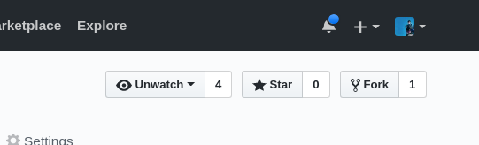

### Code Ramp - Plataforma 5

# Java Script Deep Dive

En este modulo vamos a trabajar no solo con teoria, le vamos a agregar ejercicios para que ustedes hagan y puedan testear.

## Setup

Primero que nada van a tener que hacer un `fork` de este repositorio, un fork es una copia del repo entero pero bajo nuestro propio usuario, de esta manera podemos modificarlo a gusto sin repercutir en el original.

Hagan click en el boton de `fork` arriba a la derecha.

Una vez terminado vamos a estar en un nuevo repo de nuestra pertenencia, pasemos a `clonar` el repositorio a nuestra computadora usando [_git_](../git) y trabajenlo en su editor de texto. Vayan en orden y lean primero el README.md! (se ve mejor en el browser)

* [Usando Test](./00-ProbandoTests/)
* [Tipos de Datos y Objetos (Repaso)](./01-Objetos/)
* [JavaScript Teorico](./02-JsTeorico/)
* [Intro a Functions](./03-Funciones1/)
* [Advanced Functions and Closures](./04-Funciones2)
* [Constructores](./05-Constructores)
* [Prototypal Inheritance](./06-Prototype)
* [Functional Programing](./07-ParadigmaFunctional)
* [Recursion](./08-Recursion)

### Lectura Adicional

* [JavaScript documentation](https://developer.mozilla.org/es/docs/Web/JavaScript)
* [CodePen: Entorno de Prueba](https://codepen.io/pen/)
* [YouDontKnowJS - Book Series](https://github.com/getify/You-Dont-Know-JS)
* [Eloquent JavaScript](http://eloquentjavascript.net/)
